# 🔻 PYTHON_기초1 

✔ PYTHON은 컴퓨터 프로그래밍 언어 중 하나이다. 

> * computer 정의 ) caculation + remember (컴퓨터가 하는 2가지 일)
>
> * programming 정의 ) 명령어의 모음(집합)
> * 언어 ) 자신의 생각을 나타내고 전달하기 위해 사용하는 체계 문법적으로 맞는 말의 집합
>
> 👉 따라서, 컴퓨터 프로그래밍 언어란, 컴퓨터에게 명령하는 말(말=약속)


<span style="color:blue">선언적 지식 (declarative knowledge)  사실에 대한 내용</span>

<span style="color:red">명령적 지식 (imperative knowledge) how-to</span> 

---

---

**목차 ) 파이썬 개발 환경 > 기초 문법 > 자료형 > 컨테이너**

---

---

#### 📂 PYTHON이란?  `easy to learn` 

* 다른 프로그래밍 언어보다 문법이 간단하다면서도 업격하지 않다. 

* 변수어 별도의 타입 지정이 필요가 없다. 

* 문법 표현이 매우 간견할여 프로그래밍 경험이 없어도 짧은 시간 내에 마스터 할 수 있다. 

* 문장을 구분할 때 중괄화 ({}) 대신 들여쓰기를 사용한다. 
* Expressive Language `print('Hello Python!')`
* 크로스 플랫폼 언어 : 윈도우즈, macOS, 리눅스, 유닉스 등 다양한 운영체제에서 실행가능


#### 📂  PYTHON 특징

* 인터프리터 언어 

> ◾ 소스 코드를 기계어로 변환하는 컴파일 과정 없이 바로 실행 가능
>
> ◾ 코드를 대화하듯 한 줄 입력하고 실행한 후 바로 확인이 가능 

* ⭐ **객체 지향 프로그래밍** (Object Oriented Programming)

  : 파이썬은 객체 지향 언어이며, 모든 것이 객체로 구현되어 있다. 

  * <span style="color:red">객체(object)</span> : 숫자, 문자, 클래스 등 값을 가지고 있는 모든 것


👉 **코드 스타일 가이드 지키기** 

⭐ **파이썬에서 제안하는 스타일 가이드** ) **[PEP 8 – Style Guide for Python Code](https://peps.python.org/pep-0008/)**

기업, 오픈소스 등에서 사용되는 스타일 가이드 ) google style guide

- **들여쓰기를 할때 4칸 혹은 1탭을 입력** 

---

### 1. 변수 (variable)

> 컴퓨터 메모리 어딘가에 저장되어 있는 객체를 참조하기 위해 사용되는 이름 
>
> 파이썬은 객체지향 언어이먀, 모든 것이 객체로 구현되어 있다. 

> 참조하는 객체가 바뀔 수 있기 때문에 '변수'라고 불린다.

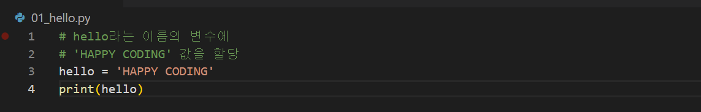

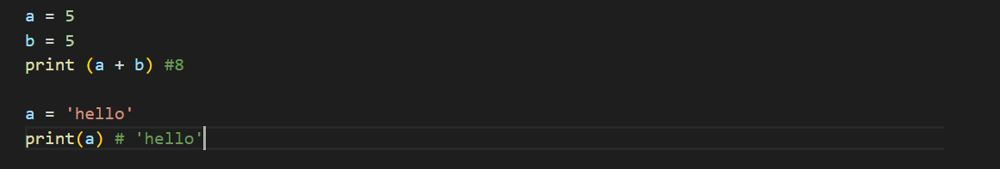

👉 코드는 기본적으로 **위**에서부터 **아래**로 실행된다. 

* 변수는 할당 연산자 (=)를 통해 값을 할당 한다.
  * 할당한다? 
  * 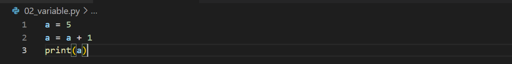


* 예시 

```python
i = 5

j = 3

s = '파이썬'
```

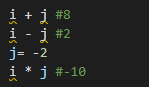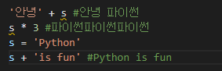

---

**[실습문제]** **: x=10 y=20일때 각각 값을 바꿔서 저장하는 코드를 작성하시오.** 

1) 임시 변수 활용하기 `tmp = x`  `x = y`  `y = tmp`  `print(x, y)`

2) pythonic!! `y, x = x, y`  `print(x, y)`

---

### 2. 식별자 (identifiers)

> 파이썬 객체를 식별하는데 사용하는 이름 

* 규칙 
  * 식별자의 이름은 영문 알파벳, 언더스코어, 숫자로 구성 
  * 첫 글자에 숫자가 올 수 없다. 
  * 길이 제한 없음, 대소문자를 구별
  * 내장함수나 모듈 등의 이름 으로도 만들면 안된다. 
  * 기존의 이름에 다른 값을 할당하게 되므로 더 이상 동작하지 않는다. 

---

### 3. 사용자 입력 

**input([prompt])**`name = input('이름을 입력해주세요')`

---

### 4. 주석 comment 

>  주석으로 처리될 내용 앞에 '#'을 입력한다. 

> 코드에 대한 설명을 작성하되, 너무 길게 작성하지 말 것 

> 중요한 점이나 다시 확인하여야 하는 부분을 표시하며 주석을 작성하는 습관은 중요함

> 주석은 코드 실행에 영향을 주지 않고 프로그램의속도를 느리게 하지 않으며 용량을 늘리지 않음


---

### 5. 파이썬 기본 자료형 python datatype


* #### Boolean (true, false )

  * 비교 논리 연산 (논리 연산자 logical operator)

    `num = 100`

    `num >= and num % 3 == 1 `

    `#true`

  

  ​      ◼ **논리식을 판단하여  true와 false를 반환함**

  * | 연산자  |               내용               |
    | :-----: | :------------------------------: |
    | A and B |     A와 B 모두 true시, true      |
    | A or B  |    A와 B 모두 false시, false     |
    |   NOT   | true를  false로,  false를 true로 |

    ◼  **AND : 모두 참인 경우 참, 그렇지 않으면 거짓** 

  * | 논리연산자 AND  | 내용  |
    | :-------------- | :---- |
    | true and  true  | true  |
    | true and false  | false |
    | false and true  | false |
    | false and false | false |

    **◼ OR : 둘 중 하나만 참이라도 참, 그렇지 않으면 거짓** 

  * | 논리연산자 OR   | 내용  |
    | :-------------- | :---- |
    | true and  true  | true  |
    | true and false  | true  |
    | false and true  | true  |
    | false and false | false |

    ◼ NOT :  true false의 반대의 결과 

  * | 논리연산자 NOT | 내용  |
    | -------------- | ----- |
    | not  true      | false |
    | not  false     | true  |

    

---

* #### Numeric (int, float, complex)

  * int 모든 정수, 매우 큰 수를 나타낼 때 오버플로우가 발생안함 

  * float 정수가 아닌 모든 실수, 부동소수점

    * 부동소수점에서 실수 연산 과정에서 발생 가능하니 주의할것 

      `값을 비교하는 과정에서 정수가 아닌 실수인 경우 주의`

      `매우 작은 수보다 작은지를 확인하거나 math 모듈 활용`

  * complex 실수부와 허수부로 구성된 복소수 

---


**✔ 산술 연산자 (Arithmetic Operator)**

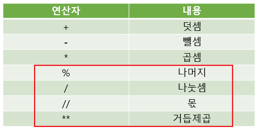

👉 나머지(%)는 짝수인지, 홀수인지 확인 하기 위해 많이 사용한다. 

`ex) 3의 배수 (3으로 나눴을 때 나머지가 0)`


**✔ 복합 연산자 (In-place Operator)**

`연산과 할당이 함께 이뤄진다.`

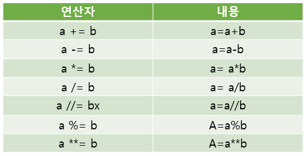


✔ 비교 연산자 (Comparison Operator)

`값을 비교하여 참과 거짓 값을 return 한다.`

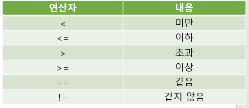


---

* #### String

  * 모든 문자는 str 타입
  * 문자열은 묶을 때 동일한 작은 따옴표나 큰 따옴표를 활용하여 표기
  * PEP8 에서 소스코드 내에서 하나의 문장 부호를 선택하여 유지하도록 함
  * 중첩 따옴표 : 따옴표 안에 따옴표를 표현할 경우 
  * 삼중 따옴표 : 작은 따옴표나 큰 따옴표를 삼중으로 사용

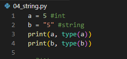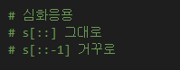

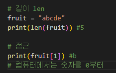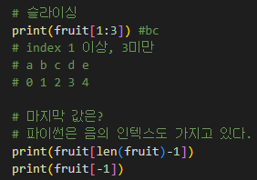

---

* **결합 +**

* **반복 ***
* **포함 여부 in**

---

####  👉 string type 활용

| \n      | 줄 바꿈                          |
| ------- | -------------------------------- |
| **\t**  | 탭                               |
| **\r**  | 캐리지리턴                       |
| **\0**  | 널null                           |
| \ \     | \                                |
| **\ *** | 단일인용부호                     |
| **\ "** | 이중인용부호                     |
| \       | **특정 문자나 조작을 위해 활용** |
| **%**   | **문자열을 변수를 활용**         |
| **f**   | **문자열을 변수를 활용**         |

---

### 6. 자료형 변환 

* <span style="color:green">암시적 : 사용자가 의도하지 않고 파이썬 내부적으로 자료형을 변환하는 경우</span>

* <span style="color:blue">명시적 : 사용자가 특정 함수를 활용하여 의도적으로 자료형을 변환하는 경우</span>


**` 문자열은 암시적 타입 변환이 되지 않음`**

**`명시적 타입 변환이 필요함`**

**`정수 형식이 아닌 경우 타입 변환 할 수 없음 `**

---

### 7. Container

>  여러개의 값을담을 수 있는 것으로 서로 다른 자료형을 저장할 수 있음

#### ◼ 순서가 있는 데이터 (시퀀스)  vs 순서가 없는 데이터 (컬렉션/비시퀀스 )

* 순서가 있는 데이터 

> 문자열(문자들의 나열), 리스트(변경 가능한 값들의 나열), 튜플(변경 불가능한 값들의 나열), 레인지 (숫자의 나열)

* 순서가 없는 데이트

> 세트(유일한 값들의 모음), 딕셔너리 (키-값들의 모음)

* none
  * 파이썬에서는 값이 없음을 표현하기 위해 none 타입 존재 

---


####  ◼ 시퀀스형 (문자열, 리스트, 튜플, 레인지)형 주요 공통 연산자. 

| 연산             | 결과                                                    |
| ---------------- | ------------------------------------------------------- |
| s[i]             | s의 i번째 항목, 0에서시작합니다.                        |
| s[i:j]           | s의  i에서 j까지의 슬라이스                             |
| s[i:j:k]         | s의 i에서 j까지 스텝 k의 슬라이스                       |
| s+t              | s와 t의 이어 붙이기                                     |
| s * n 또는 n * s | s를 그 자신에  n번 더하는 것                            |
| x in s           | s의 항목 중 하나가  x와 같으면 true 그렇지 않으면 false |
| x not in s       | s의 항목 중 하나가 x와 같으면 false 그렇지 않으면 true  |
| len(s)           | s의 길이                                                |
| min(s) / max(s)  | s의 가장 작은 항목 / s의 가장 큰 항목                   |

---

### 8. 리스트list 

> 변경 가능한 값들의 나열된 자료형
>
> 순서를 가지며, 서로 다른 타입의 요소를 가질 수 있음
>
> 변경 가능하며(mutable) 반복이 가능하다.(iterable)
>
> 항상 대괄호 형태로 정의하며, 요소는 콤마로 구분한다. `[0, 1, 2, 3, 4, 5]`


* 생성과 접근

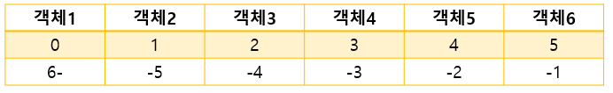

* 리스트 list 예제 

  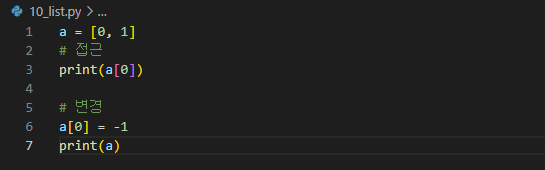


* 리스트lisdt 값 추가와 삭제 

  > .append()를 활용하여 추가하고자 하는 값을 전달한다. 
  >
  > .pop()을 활용하여 삭제하고자 하는 인덱스를 전달한다. 
  >
  > 

---

### 9. 튜플 (내부적으로 활용)

> 불변한 값들의 나열 
>
> 순서를 가지며, 서로 다른 타입의 요소를 가질 수 있음 
>
> 변경 불가능하며 반복이 가능함 
>
> 항상 소괄호 형태로 정의하며, 요소는 콤마로 구분함 `(0, 1, 2)`

---

### 10. 레인지(range)

> 숫자의 시퀀스를 나타내기 위해 사용 
>
> 변경 불가능하며 반복이 가능하다. 

`기본형` : `range(n)`

`범위 지정` : `range(n, m)`

`범위 및 스텝 지정` : `range(n, m, s)`


---

### 11. 세트(set)

> 유일한 값들의 모음 (collection)
>
> 순서가 없고 중복된 값이 없음 
>
> 수학에서의 집합과 동일한 구조를 가지며, 집합 연산도 가능하다. 
>
> 변경이 가능하며 반복이 가능하다. 


* 세트(set) 생성 

<span style="color:red">빈 set를 만들기 위해서는 set()을 반드시 활용해야 한다. </span>

<span style="color:red">빈 중괄호는 딕셔너리  </span>

> 값 추가는 .add / 삭제는 .remove


* 세트 활용

: 세트를 활용하며 다른 컨테이너에서 중복된 값을 쉽게 제거할 수 있다. 

단, 이후 순서가 무시되므로 순서가 중요한 경우 사용할 수 없다. 

`아래의 리스트에서 고유한 지역의 개수는? `

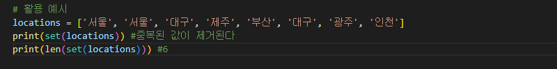

---

### 12. 딕셔너리 = 키와 값의 쌍이다.

>◾ 키-값 쌍으로 이뤄진 모음 
>
>◾ **키 : 불변 자료형만 가능**
>
>◾ **값 : 어떠한 형태든 관계 없음** 
>
>◾ 키와 값은 : 로 구분됩니다. 개별 요소는 , 로 구분됩니다. 
>
>변경 가능하며 반복이 가능합니다. 
>
>딕셔너리는 반복하면 키가 반환됩니다. 


* 키-값 추가 및 변경

: 딕셔너리에 키와 값의 쌍을 추가할 수 있으며 이미 해당하는 키가 있다면 기존 값이 변경된다. 

: 키를 삭제하고자 하면 .pop()을 활용하여 삭제하고자 하는 키를 전달