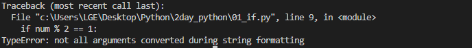

# 🔻 PYTHON_기초1 

### 📂 1. 조건문 

>  참 거짓을 판단할 수 있는 조건식과 함께 사용

* **기본형식** 

```python
if < expression : 

	#run thins code block

else:

	`#run thins code block`
```

* **예제** 

```python
a = -10

	if a >=0:

		print('양수')

	else:

		print('음수')

print(a)
```


* **예제** 

```python
a = 10

if a>= 0:

print('양수')

else:

print('음수')

print(a)
```


* **예제** 

```python
num =int(input())

print(num, type(num))

if num % 2 == 1:

 	 print('홀수')

 else:

 	print('짝수') 
```


* **TypeError**



<span style="color:blue">TypeError 나타난 이유 : 숫자로서의 num (타입 확인하기 문자열인지, 숫자인지)</span>


---


### ◼  복수 조건문 

> 복수의 조건식을 활용할 경우elif를 활용하여 표현한다. 

```python
if expression :
	#code block

elif expression:
	#code block

elif expression
	#code block
```


---


###  ◼ 중첩 조건문 

>  조건문은 다른 조건문에 중첩되어 사용될 수 있음

```python
if expression : 
	#code block
	if expression : 
		# code block
else: 
	#code block
```


* **실습 문제 ( 두 코드 비교하면서 생각해보기)**

```python
 dust = 1000
 
 if dust > 150:
 	print('매우 나쁨')
 elif dust > 80:
 	print)('나쁨')
 elif dust > 30:
 	print('보통')
 elif: 
 	if dust < 0 
    	print('음수 값입니다.')
    else:
        print('좋음')
```

```python
dust = -10

if dust > 150:
    print('매우 나쁨')
elif dust > 80:
    print('나쁨')
elif dust > 30: 
    print('보통')
elif dust > 0:
    print('좋음')
else: 
    print('음수 값입니다.')
```


**👉 <span style="color:red">단계적으로 코드가 어떻게 실행하는지 위에서부터 한줄 한줄씩 살펴보는것이 중요함!</span>**


---

###  ◼ 조건 표현식 

>  조건 표현식 conditional expression 

`양수로 바꾸는 코드 ` `value = num if num >= 0 else -num`

`num 참일 경우 `

`num >= 0 expression`

`-num 거짓일 경우 `


