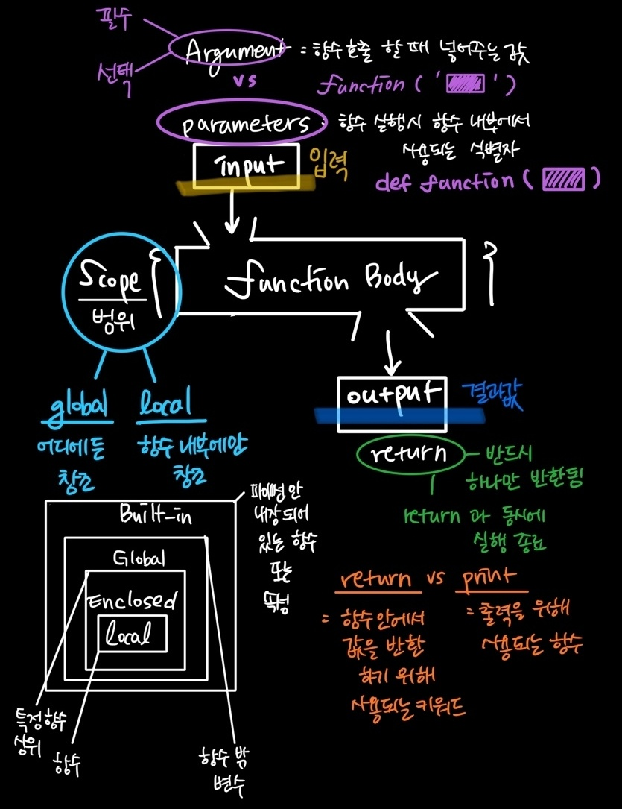

# 🔻 PYTHON_기초1 

> **<span style="color:red">how to</span>** 명령(명령적 지식)을 할때 어떠한 **단계**로 **구현**을 하고 있는가가 중요하다. 

>  **Type** : int, float, complex, bool, str, list, tuple, range, set, dictionary, none


### 📂 1. 함수  

**(function (어떠한 기능들을 추상화_ 출력))**

> 사용자 함수 Custom Function 구현되어있는 함수가 없는 경우, 사용자가 직접 함수를 작성한다. 

* 우리는 왜 함수를 사용할까? 

1️⃣ **Dexomposition**  기능을 분해하고 재사용이 가능하다. 

```python
numbers = [1, 10, 100]
result = 0
cnt = 0

for number in numbers:
    result += number #합
    cnt += 1 #카운트
    
print(result/cnt)
```

```python
print(sum(numbers)/len(numbers)) #위의 코드를 더 간결하게 작성 가능
```


2️⃣ **Abstraction** (블랙박스_) 복잡한 내용을 숨기고 기능에 집중하여 사용할 수 있다. 재사용성, 가독성 생산성


---


**◼ 함수 기본 구조 (defin&call, input, scope, output)**




**◼ 함수의 정의** 

> 특정한 기능을 하는 코드의 조각(묶음)

> 특정 명령을 수행하는 코드를 매번 다시 작성하지 않고, 필요시에만 호출하여 간편히 사용


**◼ [파이썬의 자습서](https://docs.python.org/ko/3/tutorial/index.html)** 

>  **파이썬에 대한 정보 볼 수 있으니 참고할 것!**


* **사용자 함수 Custom Function** : 구현되어 있는 함수가 없는 경우, 사용자가 직접 함수를 작성 가능

```python
def funcion_name
 	#code block
	return returning_value
```


* **내장 함수 Built-in Function** 

```python
import math 
values = [100, 75, 85, 90, 65, 95]
mean = sum(values) / len(values)
sum_var = sum(pow(values - mean, 2) for value in values) / len(values)
std_dev = math.sqrt(sum_var)
print(std_dev)
```


* **pstdev 함수** (pyton 표준 라이브러리 - statistics)_코드 중복방지, 재사용 용이

```python
import statistics
values = [100, 75, 85, 90, 65, 95]
statistics.pstdev(values)
```


**◼  선언과 호출** 

>  함수의 선언은 def 키워드 활용 / 들여쓰기를 통해 function body를 작성

> 함수는 parameter 를 넘겨줄 수 있음 

> 함수는 동작 후에 return을 통해 결과값을 전달 

>  함수는 `함수명()`으로 호출'


**◼ return** 

>  ⭐ 함수는 반드시 하나만 반환한다. 

```python
def minus_and_product(x, y)
	return x - y
	return x * y
```

👉 이코드의 문제점 : Code is unreachable (도달할 수 없는 코드라고 뜸)


👉 2개 이상의 값을 반환하고 싶다면 ? 

```python
def foo():
	return 1, 2 #하나의 튜플로 반환한다.
	
result = foo()
print(result, type(reesult))
```


 **🤔 NONE TYPE** _코드 작성 실수 금지 (print vs return)

```python
def no():
	a = 1
    
result = no()
print(result, type(result)) #none <class 'nonetype'>
```

```python
a = print('hi')
print(a, type(a)) # #none <class 'nonetype'>
```

---


### 📂 2. 함수의 입력 


**◼ parameter vs argument**

```python
def function(ham): #parameter : ham
	return ham
function('spam') #argument : 'spam'

#argument (필수와 선택으로 나눠진다.)
# 필수 : 반드시 전달되어야 하는 argument
# 선택 : 값을 전달하지 않아도 되는 경우는 기본 값이 전달 
```


◼ position arguments (기본) : 기본적으로 함수 호출 시 argument는 위치에 따라 함수 내에 전달됨 

◼  keyword arguments : 직접 변수의 이름으로 특정 argument를 전달할 수 있음 

◼ default arguments values : 기본값을 지정하여 함수 호출 시 argument값을 설정하지 않도록 함 

◼  복수의 arguments : *argu

◼ 정해지지 않는 개수의 키워드 : **kwargs

---

###  

### 📂 3. 함수의 범위 Scope

> 함수는 코드 내부에 local scope를 생성하며 그 외의 공간인 global scope 로 구분


**◼ 객체 수명주기(lifecycle)** 

> 객체는 각자의 수명 주기가 존재

`built-in scope` : `파이썬이 실행된 이후부터 영원히 유지 `

`global scope` : `모듈이 호출된 시점 이후 혹은 인텊리터가 끝날 때까지 유지`

`local scope ` :  `함수가 호출될 때 생성되고, 함수가 종료될 때까지 유지`


**◼ 이름 검색 규칙** 

> 파이썬에서 사용되는 이름(식별자)들은 이름공간(namespace)에 저장

> LEGB Rule

> 함수 내에서는 바깥 scope의 변수에 접근 가능하나 수정 불가

---


### 📂 4. 함수 응용


◼ **MAP** (function, iterable)

>  특정한 함수를 반복적으로 실행하고 싶을 때 사용

> 알고리즘 문제 풀이 시 input 값들을 숫자로 바로 활용하고 싶을 때 사용 

```python
n, m = map(int, input().split())

# input : input() 타입, 항상 string(문자열)
# .split() : 문자열.splt(), 내가 구분값을 기준으로 쪼개졌따, 반환 결과는 항상 리스트

# 문자열로 받을 것은 각각을 공백을 기준으로 리스트로 쪼갰다!
```


