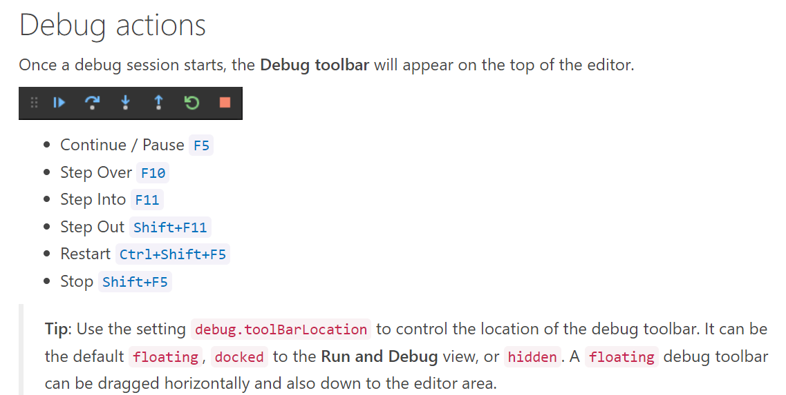
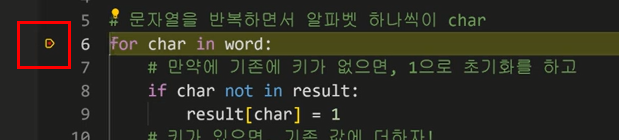
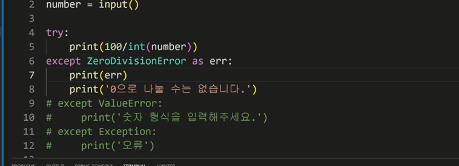

## ✔ 복습 code

```python
word = 'banana'

#print(word)
cnt = 0
for i in word:
    cnt += 1 
```


```python
word = 'banana'

result={} #딕셔너리를 초기화 하겠다는 뜻 

#키-값의 쌍 추가 
result['a'] = 0

print(result)

# 값의 추가 
my_list = []
my_list.append(1)
print(my_list)
```

```python
# 문자열 반복하면서 알파벳 chr 

for char in word:
#만약 기존에 키가 없다면, 1로 초기화
if char not in result:
	result[char] = 1
#키가 있다면, 기존 값에 1 더하기 
else:
	result[char] = result[char] +1    #not을 추가 안하면 오류 발생
```

```python
for char in word:
	result[char] = result.get(char, 0) +1
	
	#result[char] 없으면 keyerror
	#result.get(char, 0) 없으면 none 기본값을 주면 0
```

---

### 🔥 에러/예외 처리  Error / exception handling

**제어가 되는 시점 조건 / 반복, 함수 _ 원하는 곳에 잘 제어가 되고있는지 확인하기** 

◼ **branches** 모든 조건이 원하는 대로 동작하는 지 

◼ **for loops** 반복문에 진입하는지, 원하는 횟수만큼 실행되는지 

◼ **while loops** for loops 와 동일, 종료조건이 제대로 동작하는지 

◼ **function** 함수 호출시, 함수 파라미터, 함수 결과 

---

>  "코드의 상태를 신중하게 출력해가며 심사숙고하는 것보다 효과적인 디버깅 도구는 없습니다. "

>  -브라이언 커니핸-

---

### ✔ 접근 방법

* `내가 어떤 함수를 원하는지 확인하기`

* `오류가 난 지점으로 부터 단락을 나눠 하나씩 소거해나가면서 오류 해결해 나가기`

* `해당하는 위치를 찾아 에러 메시지를 해결`

* `당황해하지 말고 차분하게 신중하게 살펴보기`


◼ **print함수 활용** : 특정 함수 결과, 반복/조건 결과 등 나눠서 생각, 코드를 **bisection** 으로 나눠서 생각

◼ 개발 환경 등에서 제공하는 기능 활용 : **breakpoint, 변수 조회 등** 

◼ dpython tutor 활용 (단순 파이썬 코드를 활용)

◼ 뇌컴파일, 눈디버깅 

---

#### 💁‍♀️ [vs code debugging](https://code.visualstudio.com/docs/editor/debugging)





---

### 1. 문법에러 syntax error

: syntax error가 발생하면, 파이썬 프로그램은 실행이 되지 않음 

: 파일 이름, 줄번호, ^문자를 통해 파이썬이 코드를 읽어 나갈때 (parser) 문제가 발생한 위치를 표현 

: 줄에서 에러가 감지된 가장 앞의 위치를 가리키는 캐럿(caret) 기호(^)를 표시됨  

◾ **EOL(end of line)** : 끝나는 따옴표가 없을 경우 

◾ **EOF(end of file)** : 괄호가 하나가 빠진 경우 

◾ **invalid syntax** : while 뒤에 :기호가 없을 경우

◾ **assign to literal** : 'a' = 3  / true = 3 / 5 = 3변수에 이름을 잘 지어서 식별해달라는 오류 


### 📌 예외 

: 실행 도중 예상치 못한 상황을 맞이하면, 프로그램 실행을 멈춘다. 

(문장이나 표현식이 문법적으로 올바르더라도 발생하는 에러)

: 실행 중에 감지되는 에러들을 예외라고 부른다. 

: 예외는 여러 타입으로 나타나며 타입이 메시지의 일부로 출력된다. (nameerror, typeerror)

: 모든 내장 예외는 exception calss를 상속받아 이뤄진다. 


**◾ zerodivisionerror**

> 10/0 

: 0으로 나누고자 할 때 발생

**◾ nameerror**

> print(name_error)

: 선언되지 않은 변수일 때 발생, namespace 상에 이름이 없는 경우_ 대부분 오타일 때 발생 

---

## 2. typeerror_타입 불일치

> 1 + '1'

👉 **unsupported operand type(s) for + : 'int' and 'str'**

(변수 안에 값을 보면 이해하기 쉬워지는 오류) 

> round('3.5')

**👉 type str doesn't define_round_method**

> divmod()

**👉  div 와 mod 를 나눠서 생각하기_ 몫과 나머지로 하나의 튜퓰로 반환해주는 함수** 

**divmod expected 2 arguments, got 0**

> import random
>
> random.sample()

👉 **sample() missing 2 required** **positional arguments: 'population' and 'k'**

> divmod(1, 2, 3 )

👉 **divmod expexted 2 arguments, got 3**

> import random
>
> random.sample(range(3), 1, 2)

👉 **type sampel() takes 3 positional arguments but 4 were given**

> import random
>
> random.sample(1, 2)

👉 **population must be a sequence or set.**

---

## 3. valuerror 

: 타입은 올바르나 값이 적절하지 않거나 없는 경우 

>  int('3.5')

invalid literal 이런 형태의 문자열을 사용할 수 없다. 

>  range(3).index(6)

6is not in range 이 범위안에 6라는 것은 없다. 

---

## 4. indexerror

**indexerror : list index out of range**

: 범위를 벗어난 리스트 인텍스 즉, 리스트 안에 데이터 수가 부족하다면 발생하는 에러 

## 5.  keyerror

**실제로 key 가 없어서 발생하는 에러** 


## 6. modulenotfound error

**존재하지 않는 모듈을 import 하는 경우** 


## 7. importerror 

**모듈은 있으나 존재하지 않는 클래스/함수를 가져오는 경우(오타일 경우 많이 발생)**

#### 

## 8. indentation error

**들여쓰기가 잘 되어있지 않은 경우** 


## 9. keyboardlnterrupt 

**임의로 프로그램을 종료했을 때** 

```python
while true:
	print(1)
```


---

### 🔥 예외처리 

: 예외처리를 할 수 있는 구문이 있는데, 그중에 try문 과 except절이 있다. 

**◼ try** 

: 오류가 발생할 가능성이 있는 코드를 실행 

: 예외가 발생되지 않으면, except 없이 실행 종료 

**◼ except**

: 예외가 발생하면, exvept절이 실행

: 예외 상황을 처리하는 코드를 받아서 적절한 조치를 취함 


```python
try:
    실행 시도할 명령
except:
    에러 발생시 실행할 명령
```

```python
# 특정 에러 처리 
try:
    실행 시도할 명령
except 에러이름:
    명시된 이름의 에러가 발생했을 때 실행할 명령
```


```
num = input('숫자 입력 :')
print(int(num))
# 숫자 입력 : 3
# 3
```

```python
num = input
```

---

### 예시 (1)

```python
#숫자 입력을 받아서 출력
numbers = input('숫자를 입력해주세요: ')
print(numbers)
# 숫자 입력 : 5
# 5
# 문자열_형변환 하기 전이기 때문

if numbers == 5:
	print('오')
else:
	print('오아님')
# 오아님

if int(numbers) == 5:
	print('오')
else:
	print('오아님')
# 오

```

```python
tri:
	if int(numbers) == 5:
	print('오')
else:
	print('오아님')
except: 
	print('숫자를 입력하지 않았습니다.')

# hi
# 숫자를 입력하지 않았습니다. 
```

---

### 예시 (2)

```python
#100을 사용자가 입력한 숫자로 나눠서 결과를 출력 
number = input()

print(100/int(number))
#10 
#10.0
```

```python
#100을 사용자가 입력한 숫자로 나눠서 결과를 출력 
number = input()

try:
    print(100/int(number))
except ZerodivisionrError:
	print('0으로 나눌 수는 없습니다.')
except ValueError:
    print('숫자형식을 입력해주세요.')
except Exception:
    print('오류')
#zerodivisionrError
#valueError

#구조화 하기 
```


* try : 코드를 실행함 

* except : try문에서 예외가 발생 시 실행함 

* else try : 문에서 예외가 발생하지 않으면 실행함 

* finally : 예외 발생 여부와 관계없이 항상 실행함 


### 예외처리 예시 

**에러를 발생시키는 것이 아닌, 에러가 발생했을 때 다른 일을 발생시키는 것** 

```python
try:
	num = input('숫자입력 :')
	print(int(num))
except ValuError:
	print('숫자가 아닙니다.')
```

```python
try:
	num = input('100으로 나눌 값을 입력하시오:')
	100/int(num)
except(ValuError, ZeroDivisionError):
	print('제대로 입력해줘')
```


---

### 🔥예외 발생 시키기 

◼ **raise statement** 

: 예외를 강제로 발생 

```python
a = 1

raise

#실행시킬 때마다 에러가 발생
#내부적으로 작성하는 것 
```

---

⭐에러 메시지 해석하는 것에 더 집중하기 

---



division by zero 

0으로 나눌 수는 없습니다. 

