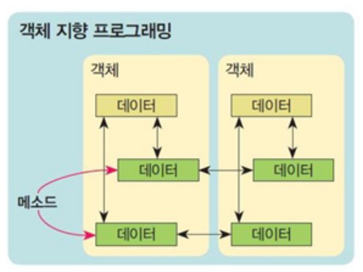

## 📌 OOP(Object oriented programming) 

##  **<span style="color:red"> 객체지향프로그래밍 </span>**

> **프로그램을 여러 개의 독립된 객체들과 그 객체들 간의 상호작용으로 파악하는 프로그래밍 방법** 
>
> (**지향** : 그 방향으로 가려고 한다. )


◼ 파이썬은 모든 것이 **객체(object : ~것)** 이다. 

◼ 객체(object)는 특정 타입의 **인스턴스(instance)**이다. 

_(클래스 기반으로 만들어진 객체라고 이해하기)

ex1) 123, 900, 5 는 모두 int의 인스턴스 

ex2) 'hi' 'bye' 는 모두 string의 인스턴스

ex3) [232, 89, 1], [] 모두 list의 인스턴스


◼ 객체(object)의 특징은?

- **타입(type)** : 어떤 연산자(operator)와 조작(method)이 가능한가?

  - 객체는 특정 타입(class)의 인스턴스(사례, 예시) 이다. )(123, 900, 5는 모두 int의 인스턴스 )

    - ```python
      a = [1, 2, 3]
      print(a, type(a)) # [1, 2, 3] list
      b = '123'
      print(b, type(b)) #123 str
      ```

- **속성(attribute)** : 어떤 상태(데이터)를 가지는가?

- **조작법(method)** : 어떤 행위(함수)를 할 수 있는가? (메서드는 **동사**적 함수 s.v())

  - ```python
    [1, 2] + [3, 4] == [1, 2, 3, 4]
    
    'a' upper() #메서드
    [1, 2, 3] append(3)
    ```

    

---

### **👉 [객체지향 프로그래밍에 대해 더 알아보기](https://hongong.hanbit.co.kr/%ED%8C%8C%EC%9D%B4%EC%8D%AC-%EC%9A%A9%EC%96%B4-%EC%A0%95%EB%A6%AC-3%ED%83%84-%EB%AA%A8%EB%93%88-%ED%81%B4%EB%9E%98%EC%8A%A4/)**

: 프로그램을 개발하는 기법으로 부품에 해당하는 객체들을 먼저 만들고, 이것들을 하나씩 조립 및 연결해서 전체 프로그램을 완성하는 기법이다. 

* 객체 지향 프로그래밍의 특징 : 상속, 다형성, 캡슐화 

🔹 **class 클래스** : 객체에 포함할 변수와 함수를 미리 정의한 것, 객체의 설계도에 해당

🔹 **abstraction 추상화** : 프로그램에서 필요한 요소만을 사용해서 객체를 표현한 것 

🔹 **object 객체** : 여러가지 속성을 가질 수 있는 대상 

🔹  **instance 인스턴스** : 클래스 기반으로 만들어진 객체 

> 속성을 가진 대상인 객체는 클래스를 이용하여 가공하기 쉬운 인스턴스로 구현이 가능
>
> 클래스는 객체가 가지는 기능을 메소드와 속성으로 정의하고, 필요할 때마다 생성자 호출로 같은 기능과 속성을 가지는 인스턴스를 만들 수 있도록 함 
>
> 그렇기 때문에 흔히 객체와 인스턴스라는 용어는 혼용되어 사용이 되어진다. 
>
> 인스턴스는 객체를 프로그래밍으로 구현한 개념이기 때문!

---

|                     절차지향 프로그래밍                      |                     객체지향 프로그래밍                      |
| :----------------------------------------------------------: | :----------------------------------------------------------: |
|                  데이터와 함수로 인한 변화                   |     데이터와 기능(메소드)분리, 추상화된 구조(인터페이스)     |
|  |  |

#### 🔻 [절차지향 vs 객체지향](https://blog.wishket.com/%EC%A0%88%EC%B0%A8%EC%A7%80%ED%96%A5-%EB%B6%84%EC%84%9D-vs-%EA%B0%9D%EC%B2%B4%EC%A7%80%ED%96%A5-%EB%B6%84%EC%84%9D-%EC%B0%A8%EC%9D%B4%EC%A0%90%EC%9D%80/)

* 절차지향 분석은 서비스를 큰 틀에서 어떤 과정을 통해 서비스가 운영되는지를 분석한다. 
* 절차지향 분석은 더 큰 규모를 단순하게 정리하고, 단순화해 보여주는 역할을 한다. 
* 객체지향 분석은 서비스를 박스와 그 안의 데이터들의 연결관계를 통해 분석 한다. 
* 객체지향 분석은 서비스 안의 데이터들을 더 자세하게 분석하는 역할을 한다. 
* 절차지향과 객체지향 분석은 서로 반대되는 개념이 아니다. 두 가지 모두 개발을 위해 꼭 필요한 방식이다.


### 🧐 절차지향 프로그래밍 


### 🧐 현실 세계를 프로그램 셀계에 반영(추상화) person

```python
# 홍길동 person 
name_hong = '홍길동'
hong_age = 100
hong_gender = 'M'

ko_name = '고길동'
ko_age = 40
ko_gender = 'M'
```

```python
hong {
	'name': '홍길동',
	'age': 100,
	'gender': 'M'
}
```

```python
# 문법 자체보다 결과를 살펴보기 

# print(type(hong))
<class '_ _main _ _Person'>
```


```python
class Person:
    def __init__(self, name, gender):
        self.name = name
        self.name = gender
        
    def greeting_message(self):
        return f'안녕하세요, {self,name} 입니다.'
```

```python
sukyung = Person('수경', '여')
print(sukying.greeting_message())
#안녕하세요, 수경입니다. 

su = Person('수', '여')
print(su.greeting_message())
#안녕하세요, 수입니다. 
```


---

#### 🔥 정리하면서 적은 MEMO

* 클래스는 person / list이고 

* 인스턴스는 수경이다. / [1, 2, 3] 이다. 

* 클래스를 활용해서 내가 원하는 자료구조를 만들 수 있다고 생각하기 

* 리스트, 딕셔너리 모두 클래스로 정의되어 있는데 이런 것들은 많은 사람들이 만들어 놓으면 편하기 때문에 파이썬에서 대신 만들어 줬다 라고 생각하면 된다. 

* 클래스 내부 정의 함수는 메서드 라고 한다. 
* 

---

### ✅ 객체 지향 프로그래밍 정리 

◼ 사각형 :  **<span style="color:red"> 클래스</span>**

◼ 각 사각형(r1, r2) :  **<span style="color:red"> 인스턴스 </span>**

◼ 사각형의 정보(가로길이, 세로길이) :  **<span style="color:red"> 속성</span>**

◼ 사각형의 행동/기능(넓이를 구한다. 높이를 구한다.) :  **<span style="color:red"> 메소드</span>**

◼ 각 인스턴스의 속성들을 메소드를 통해 활용한다. 


```python
# 절차지향 프로그래밍 

a = 10 
b = 30
square1_area = a * b
square1_circumference = 2 * (a + b)

c = 300
d = 20
square2_area = c * d
square2_circumference = 2 * (c + d)
```

```python
# 절차지향 프로그래밍 
def area(x, y):
    return x * y

def circumference(x, y):
    return 2 * (x + y)

a = 10
b = 30
c = 300
d = 20 
square1_area = area(a, b)
square1_circumference = circumference(a, b)
square2_area = area(c, d)
square2_circumference = circumference(c, d)
```

```python
# 객체지향 프로그램 
class Rextangle:
    def__init__(self, x, y):
        self.x = y
        self.y = y
        
    def area(self):
        return self.x * self.y
    
    def circumference(self):
        return 2 * (self.x + self.y)
    
r1 = Rectangle(10, 30)
r1.area()
r1.circumference()

r2 = Rectangle(300, 20)
r2.area()
r2.circumference()
```

---

```python
print(sum, type(sum))
print(len,type(len))
print([1, 2, 3], type([1, 2, 3]))
peint([], type([]))

#sum은 함수입니다. 

# [].sort()는 메서드 입니다. 
#리스트가 쓸 수 있는 함수 이니까요.

name = '홍길동'
#name은 str 클래스의 instance(값)인 '홍길동'을 담는 변수일 뿐입니다. 


#클래스 : str, person,
#인스턴스 : '123', 임수경
#객체 : 모든 것
```

---


---

```python
my_list = [1, 2, 3]
#리스트.sort()
#리스트의 데이터를 직접 정렬 
my_list.sort()

my_list = [1, 2, 3]
#리스트는 sorted 함수의 인자로 전달 될 뿐 
sorted(my_list)
```

---

### 📜 객체 지향의 장점 

객체지향 프로그래밍은 **프로그램을 유연하고 변경이 용이**하게 만들기 때문에 

대규모 소프트웨어 개발에 많이 사용됨  (즉, 편리하게 사용할 수 있다고 생각하기)

프로그래밍을 더 배우기 쉽게 하고 **소프트웨어 개발과 보수를 간편**하게 하며, 보다 

**직관적인 코드 분석**을 가능하게 하는 장점 가짐 

---

 

### 🔻 기본문법


```python
class Person: 
	pass
print(type(Person))
#type
p1 = Person()
type(P1)
# __main__.Person
ininstance(person1, Person)
#True
```


* **속성 : 특정 데이터 타입/ 클래스의 객체들의 가지게 될 상태 / 데이터를 의미**
* **메소드 : 특정 데이터 타입 / 클래스의 객체에 공통적으로 적용 가능한 행위(함수)**

---


### 🔻객체 비교하기 

* **==**
  * 동등한 (equal)
  * 변수가 참조하는 객체가 동등한 경우 true
  * 두 객체가 같아 보이지만 실제로 동일한 대상을 가리키고 있다고 학인해 준 것은 아님 
* **is**
  * 동일한 (identical)
  * 두 변수가 동일한 객체를 가리키는 경우 true

```python
# 얕은 복사 
a = [1, 2, 3]
b = a
b[0] - 'hi'

# a를 출력 ['hi', 2, 3]
# b를 출력 ['hi', 2, 3]

#list 형변환 결과 : 사실은 list이고 사실은 값도 같지만 다른 메모리 주소 결과를 받아냄 


# 슬라이싱
e = [4, 5, 6]
f = e[::]
f[0] = 'hi'

# 깊은 복사 
a = [[1, 2], 2, 3]
b = list(a)
b[0][0] = 'hi'

print(a) #[[1, 2], 2, 3]
print(b) # [['hi',2], 2, 3]

import copy
a = [[1, 2], 2, 3]
b = copy.deepcopy(a)
b[0][0] = 'hi'
print(a) 
print(b)
```

---

### 🔻 인스턴스 변수 

##### : 인스턴스가 개인적으로 가지고 있는 속성 

##### : 각 인스턴스들의 고유한 변수 

* 생성자 메소드에서 self.< name >으로 정의 
* 인스턴스가 생성된 이후 < instance >. < name > 으로 접근 및 할당 

```python
#인스턴스 변수 정의 
self.name = name 

#인스턴스 변수 접근 및 할당
print(john.name)
john.name = 'John Kim'
```


### 🔻 인스턴스 메소드 

: **인스턴스 변수를 사용하거나, 인스턴스 변수에 값을 설정하는 메소드**

: **클래스 내부에 정의 되는 메소드의 기본** 

: 호출 시, **첫번째 인자**로 인스턴스 **자기 자신 (self)** **전달**됨

```python
class MyClass
	def instance_method(self, arg1, ...)
```

```python
my_instance = MyClass()
my_instance.instance_method(...)
```


#### 👉 self 란 : 인스턴스 자기자신!

**self로 정의하는 것이 중요** **(파이썬의 암묵적인 규칙)**

**파이썬에서 인스턴스 메소드는 호출 시 첫번째로 전달 되도록 설계**


### 🔻생성자 메소드 

**: 인스턴스 객체가 생성될 때 자동으로 호출되는 메소드**

**: 인스턴스 변수들의 초기값을 설정** 

: 인스턴스 생성 

: _ _ init _ _ 메소드 자동 호출 

```python
class Person:
	
	def __inint__(self):
		print('인스턴트가 생성되었습니다.')
```

```python
personal = Person()

# 인스턴스가 생성되었습니다. 
```


### 🔻소멸자 메소드

##### : 인스턴스 객체가 소멸되기 직전에 호출되는 메소드  

```python
class Person:

	def __del__(self):
		print('인스턴스가 사라졌습니다.')
```

```python
personal = Person()
del personal

# 인스턴스가 사라졌습니다. 
```


---

### 📜 예시 코드 


```python
class person:
	pass
	
#person 클래스의 인스턴스 iu
iu = person()
#iu의 인스턴스 변수 
iu.name = '아이유'
iu.age = 28
iu.gender = 'f'
#인스턴스 변수 접근 
print(iu.nmae)
```


### 📜 코드 비교하기 


---


### 🔥 최종정리


