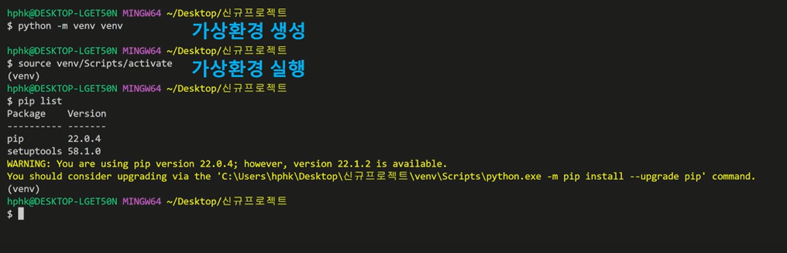
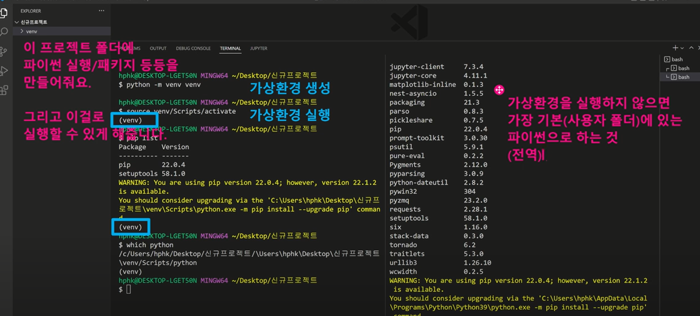

## 📂 Python_응용/심화

* **list Comprehension** 

: 표현식과 제어문을 통해 특정한 값을 가진 리스트를 간결하게 생성하는 방법 

```python
[<expression> for <변수> in <iterable>]
[<expression> for <변수> in <iterable> if <조건식>]
```

```python
#list comprehension

even_list = [i for i in range(10) if i % 2 == 0]
print(even_list)

even_list = [i**2 for i in range(10) if i % 2 == 0]
print(even_list)
```

```python
# 1~3의 세제곱의 결과가 담긴 리스트 만들기 

cubic_list = []
for number in range(1, 4)     #이부분!
	cubic_list.append(number**3) 
print(cubic_list)

[number**3 for number in range(1, 4)] #코드 잘 살펴보기
```

---

* **Dictionary Comprehension**

: 표현식과 제어문을 통해 특정한 값을 가진 리스트를 간결하게 생성하는 방법 

```python
{key: value for <변수> in < iterable > }  

{key: value for <변수> in < iterable> if <조건식>}
```

```python
# 1~3의 세제곱의 결과가 담긴 딕셔너리 만들기 
cubic_dict = {}
for number in range(1, 4):
    cubic_dict[number] = number ** 3
print(cubic_dict)

{number: number**3 for number in range(1, 4)}
```

---


```python
# map(____, _____)
# map(int, input().split())
# int 함수를 적용하는 것 
# map(함수, 반복가능한 것)
# 반복 가능한 것들의 모든 요소에 함수를 적용시킨 결과를 
# map object로 반환한다. 

#int형 변환함수를 
#input으로 받은 것을 쪼갠 결과인 리스트에 각각 적용한다. 

# 기본 반복 / 조건 코드
numbers = [1, 2, 5, 10, 3, 9, 12]
result = []
for number in numbers:
    if numbers % 3 == 0:
        result.append(number*3)
print(result)     # [3, 6, 15, 30, 9, 27, 36]

# 만약 map으로 사용하고 싶다면?
# (이 코드가 좋다는 것은 아님)
# 첫번째로 함수를 정의해야 한다. 

def divided_by_3(number):
    return number * 3

print(list(map(multiple_3, numbers)))
# [3, 6, 15, 30, 9, 27, 36]

# 이 함수는 계속 사용되지 않고, map에서만 사용된다. 
# 임시적인 함수를 만들고 싶다. => lambda
# 람다 활용
print(list(map(lambda n: n*3, numbers)))
# [3, 6, 15, 30, 9, 27, 36]
```


* **lambda [parameter] : 표현식**

: 표현식을 계산한 결과값을 반환하는 함수로, 이름이 없는 함수라서 익명함수라고도 불린다. 

: return 문을 가질 수 없다. 

: 간편 조건문 외 조건문이나 반복문을 가질 수 없다. 

: 함수를 정의해서 사용하는 것보다 간결하게 사용이 가능하며 def를 사용할 수 없는 곳에 사용 가능하다.


🔻 **filter (functin, iterable)**

```
# 기본 반복 / 조건 코드
numbers = [1, 2, 5, 10, 3, 9, 12]

result = []
for number in numbers:
    if numbers % 3 == 0:
        result.append(number*3)
print(result)     

print(filter(lambda n: n%3==0, numbers))
# filter object 

# 함수 활용
def is_3(n):
	if n % 3 == 0:
		return True
	else:
		return  False
		
#위의 코드와 같은 코드 
return n5 3 == 0 #true, false 불린형

# filter : 순회 가능한 데이터구조의 모든 요소에 함수를 적용하고 그 결과가 true인 것들을 filter objext로 반환 
# map(function, ___)
fuction : 모든 iterabble에게 함수 적용하고 
```

---

* **pip**

: 파이썬 패키기 관리자 

: PyPI에 저장된 외부 패키지들을 설치하도록 도와주는 패키지 관리 시스템 

`pip install SomePackage`

`pip install SomePackage==1.0.5`

`pip install 'SomePackage>=1.0.4`

👉 모두 bash, cmd 환경에서 사용되는 명령어!


* 패키지 삭제 : `pip uninstall SomePackage`

* 패키지 목록 및 특정 패키지 정보 

  : `pip list`

  : `pip show SomePackage`

* 해당하는 목록을 requirements.txt로 만들어 관리함 : `pip freeze`

* 패키지 관리하기

  : `pip freeze > requirements.txt`

  : `pip install -r requirements.txt`

---

* 가상환경 

  : 파이썬 표준 라이브러리가 아닌 외부 패키지와 모듈을 사용할 경우 모두 pip를 통해 설치해야 한다.

  : 복수의 프로젝트를 하는 경우 버전이 상이할 수 있으니 참고할 것!

  : 가상환경을 만들어 프로젝트별로 독립적인 패키지를 관리할 수 있다. 


* **venv**

​	: 가상환경을 포함하는 디렉토리의 이름 

​	: 가상환경 비활성화 : `$ deactivate` 명령어를 사용

* **python -m venv venv**





### **프로젝트 마다 패키지라는 걸 별도로 관리하기 위해서**


