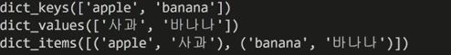
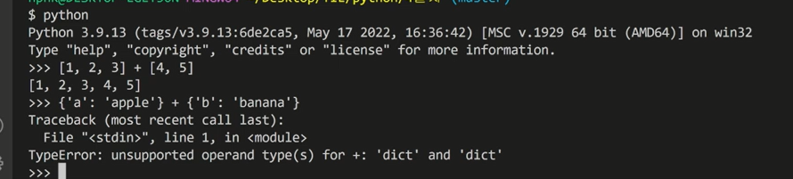

# 🔻 PYTHON_기초1 

**📜 python을 더 공부하고 싶다면!?**

* 파이썬 자습서(공식문서)

* 파이썬 위키독스(점프 투파이썬) = 온라인 책

* 파이썬 코딩도장 = 온라인 책 

* MIT python = 전공지식

---

### 📂 데이터 구조 

◾ input().split()

> input() : type 문자열

◾ [1,2,3].append(4)

> 리스트.append() 


---

```python
# 리스트_메서드 활용
a = [10, 1, 100]
# 정렬 (sort)
new_a = a.sort() 
print(a, new_a)
# [10, 1, 100] none
# 리스트 메서드에 활용하면, 그 메서드를 정렬된 상태로 변경(원본 변경)


# 리스트에 sorted 함수를 활용
b = [10, 1, 100]
# 정렬(sort)
new_b = sorted(b) 
print(b, new_b)
# [10, 1, 100] [10, 1, 100]
# sorted 함수를 활용하면, 원본을 변경하지 않음 
# return되는 것은 정렬된 리스트

# 실제 활용코드 
a = [10, 1, 100]
a.sort()
#를 정렬된 상태로 활용

b = [10, 1, 100]
b = sorted()
```

---


### 1. 문자열

>  문자들의 나열 

>  문자열은 작은 따옴표나 큰 따옴표를 활용하여 표기 


#### **◼ 문자열 탐색** 

`.find(x)` x의 **<span style="color:red"> 첫번째 위치 </span>**를 반환, **<span style="color:red"> 없으면, -1 </span>**

`.index(x)` x의 첫번째 위치를 반환, **<span style="color:red"> 없으면, 오류발생 </span>**


#### ◼ 문자열 관련 검증 메소드 

`.isalpha`

`.isupper()`

`.islower()`

`.ititle()`

---

#### ⭐ 문자열 변경 

**✅ .replace(old, new[,count])**       

* `[,count]은 선택`

* 바꿀 대상 글자를 새로운 글자로 바꿔서 **<span style="color:red"> 반환 </span>**

* count를 지정하면, 해당 개수만큼만 시행 


**✅ .strip([chars])**

* 특정한 문자들을 지정하면, 

* 양쪽을 제거(strip)하거나, 왼쪽을 제거(lstrip)하거나, 오른쪽을 제거(rstrip) 

* 대부분 문자열을 지정하지 않으면 **<span style="color:red"> 공백(space와 enter도 포함)을 제거할때 자주 사용 </span>**한다. 


**✅ .split(sep=none, maxsplit=-1)**

* 문자열을 특정한 단위로 나눠 **<span style="color:red"> 리스트</span>**로 반환

: sep이 none이거나 지정되지 않으면 연속된 공백 문자를 단일한 공백문자로 간주하고, 선행/후행 공백은 빈 문자열에 포함시키지 않음 

* maxsplit이 -1인 경우에는 제한이 없음 


**✅ 'separator'.join([iterable])**

* 반복가능한 컨테이너 요소들을 separator 로 합쳐 문자열 반환한다. 

* iterable에<span style="color:red"> **문자열이 아닌 값이 있으면  typeerror 발생**</span>한다. 

```python
names = ','.join(['홍길동', '김철수'])
print(names)

#홍길동,김철수
```

```python
numbers = ''.join([10, 20, 100])
print(numbers)

#typeerror : sequence item 0 : expected str instance, int found 오류발생 
```

**👉 문자열로 바꾸고 싶다면?**

```python
numbers = ''.join(map(str, [10, 20, 100])) # str:형변환
print(numbers)
```

---

**📌 문자열은 스스로 바뀌는 경우가 없다. **

**🤔 why = immutable 이기 때문 / 모두 바뀐 결과를 반환한다.** 

<span style="color:blue"> **( inmutable = 문자열, 튜플, 레인지)**</span>

---


### 2. 리스트

**.append .pop .sort .count** 


**✅ .append(x)**

* 리스트 <span style="color:red"> **마지막**</span>에 값을 추가함 

* .extend(iterable) 
* **#iterable에 무엇을 넣은가가 중요하다.**

* 리스트에 iterable 추가함 

```python
a = ['apple']
a.extend('banana', 'mango')
print(a)
# typeerror : list.extend() takes

# ('banana', 'mango') => (['banana', 'mango'])

# a.extend('banana') 문자열 하나씩 출력됨
```


**✅ .insert(i, x)**  : 정해진 위치에 i에 값을 추가함 (다재다능)


**✅ .remove(x)**  : 리스트에서 값이 x인 것 **삭제**

: 리스트 가장 왼쪽에 있는 항목(첫번째) x를 제거 

: 항목이 존재하지 않을 경우 value error


**✅ .pop(i)**

* **<span style="color:red"> 정해진 위치 i</span>**에 있는 값을 삭제하고, 그 항목을 반환

* i가 지정되지 않으면, **마지막 항목**을 삭제하고 반환


**✅ .clear()** : 모든 항목을 삭제

---


### 3. 탐색 및 정렬

**✅ .index(x)** : x값을 찾아 해당 index 값을 반환, 없는 경우 valueerror 발생 


**✅ .count(x)**

* 원하는 값의 개수를 반환 #리스트 순회

ex)  (for)하며 값이 1인 것을 count +=1 한다. 


**✅ .sort()** : 원하는 리스트를 정렬. none반환


**✅ .reverse()** : 순서를 반대로 뒤집음(정렬하는 것이 아님), none반환


---

```python
a = [1, 2, 3]
a = a.append(4)
# 코드의 결과는 none
# a.append(4) 의 return 값을 a에 저장한다. 
# 리스트.append()의 메서드는 반환값이 none이다. 
print(a)

a = [1, 2, 3]
a.append(4)
print(a)

a = [1, 2, 3]
#sum 함수의 return 값을 변수 result에 할당 
result = sum(a)
```


**◼  mutable vs immutable**

```python
# 리스트는 mutable
a = [1, 2, 3]
a[0] = 100
print(a)
# [100, 2, 3]

# ⭐핵심 : 리스트는 바꿀 수 있다. 

#문자열은 immutable
a = 'hi'
a[0] ='c'
print(a)
# 타입에러 : str object does not support item assignment

# ⭐핵심 : 문자열의 첫번째 인덱스에 해당하는 값을 바꿀수 있는가?
```

---

**📌 주의할 점** 

```python
print('1 2 3'.split().index('2')+10)

#'1 2 3'.split() 를 ['1', '2', '3'].index('2')
# index('2') 까지 1이라는 답이 나옴 
# 1 + 10 = 11
```

---


### 4. 딕셔너리 (키-값)

**✅ .get(key[,default])**

* key 를 통해 value 를 가져옴 

* key error 가 발생하지 않으며 default 값을 설정 가능(none 기본)


**✅ .pop(key[,default])**

key가 딕셔너리에 있으면 제거하고 해당 값을 반환 

그렇지 않으면 default 반환

 default 값이 없으면 key error 발생 


✅ **.update([other]**) : 값을 제공하는 key, value 로 덮어 씁니다. 


```python
#기본순회
#키가 기준이고 직접 딕셔너리에 key로 접근하면 value를 얻을 수 있다. 
my_dict = {'apple': '사과', 'banana' : '바나나'}

for word in my_dict:
	print(word)

# apple
# banana


# value 접근
for word in my_dict:
	print(word, my_dict[word])
	
```


```python
# 다양한 방법 => 일종의 리스트!
print(my_dict.key()) 

print(my_dict.values())
for value in my_dic.values():
    print(value) # 사과, 바나나


# 일종의 리스트안에, tuple!
print(my_dict.items())
for k, v in my_dick.items():
    print(k, v)
    
#k, v는 문자열_이름붙이기
```



---

```python
my_dict_2 = {}
my_dict_2['a'] = 'airplane'

my_dict_3 = {'a':0}
my_dict_3['a'] += 1
my_dict_3 = my_dict_3['a'] + 1
print(my_dict_3)
```

```python
my_list = [0, 1, 2]
my_list[0] = my_list[0] + 1
```


---

**⭐ 주의사항**

✔ **딕셔너리는 키로 접근하고 리스트는 인덱스로 접근하기** 

✔**딕셔너리는 합쳐지지 않는다**

---

```python
my_dict = {'apple': '사과', 'banana':'바나나'}
print(my_dict['aplle']) # 사과

for word in my_dict: # 'apple', 'banana'
    print(my_dict[word])
```




