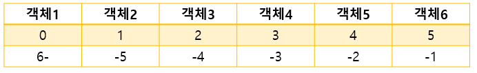
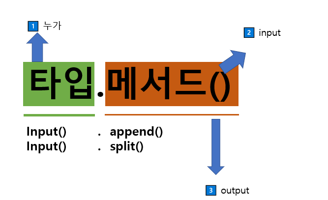

# 📂 **PYTHON**

#### ✅ [DAY2_실습문제](https://github.com/oiosu/python_study/tree/main/2day_python/day2_%EC%8B%A4%EC%8A%B5%EB%AC%B8%EC%A0%9C)    ✅ [DAY3_실습문제](https://github.com/oiosu/python_study/tree/main/3day_python)   ✅ [DAY4_실습문제](https://github.com/oiosu/python_study/tree/main/4day_%EC%8B%A4%EC%8A%B5%EB%AC%B8%EC%A0%9C)  ✅ [DAY6_실습문제](https://github.com/oiosu/python_study/tree/main/6day_python)  ✅ [DAY7_실습문제](https://github.com/oiosu/python_study/tree/main/day7_20%2C21) 
---
### 😎 If you want to know more, please visit My Blog!!!!
### [ARU](https://areuready.tistory.com/) https://areuready.tistory.com/
---
### [ **PYTHON은 컴퓨터 프로그래밍 언어 중 하나이다.** ](https://github.com/oiosu/python_study/blob/main/1day_python/PYTHON_1.md)

* 선언적 지식 (declarative knowledge)  사실에 대한 내용

* 명령적 지식 (imperative knowledge) how-to 
---
### 🧐 `easy to learn` 
* 다른 프로그래밍 언어보다 문법이 간단하다면서도 업격하지 않다. 

* 변수어 별도의 타입 지정이 필요가 없다. 

* 문법 표현이 매우 간견할여 프로그래밍 경험이 없어도 짧은 시간 내에 마스터 할 수 있다. 

* 문장을 구분할 때 중괄화 ({}) 대신 들여쓰기를 사용한다. 
* Expressive Language `print('Hello Python!')`
* 크로스 플랫폼 언어 : 윈도우즈, macOS, 리눅스, 유닉스 등 다양한 운영체제에서 실행가능
---
### 💁‍♀️ PYTHON 특징_인터프리터 언어 

◾ 소스 코드를 기계어로 변환하는 컴파일 과정 없이 바로 실행 가능

◾ 코드를 대화하듯 한 줄 입력하고 실행한 후 바로 확인이 가능 

* ⭐ **객체 지향 프로그래밍 (Object Oriented Programming)**

  : 파이썬은 객체 지향 언어이며, 모든 것이 객체로 구현되어 있다. 

  * 객체(object) : 숫자, 문자, 클래스 등 값을 가지고 있는 모든 것
---
### ⭐ **파이썬에서 제안하는 스타일 가이드** )  **[PEP 8 – Style Guide for Python Code](https://peps.python.org/pep-0008/)**
  ---
  ### ◼ 변수 (variable)
  > 컴퓨터 메모리 어딘가에 저장되어 있는 객체를 참조하기 위해 사용되는 이름 

  > 파이썬은 객체지향 언어이먀, 모든 것이 객체로 구현되어 있다. 

  > 참조하는 객체가 바뀔 수 있기 때문에 '변수'라고 불린다.
  
  
  ### ◼ 식별자 (identifiers)
  > 파이썬 객체를 식별하는데 사용하는 이름 [규칙 알고 있기]
  
  
  ### ◼사용자 입력 
  > **input([prompt])**`name = input('이름을 입력해주세요')`
  
  ### ◼ 주석 (comment)
  > 중요한 점이나 다시 확인하여야 하는 부분을 표시하며 주석을 작성하는 습관은 중요함
  
  ---
  
  ### 📜 파이썬 기본 자료형 python datatype
  

### ◼ Boolean (True, False )

◼ 비교 논리 연산 (논리 연산자 logical operator)

  `num = 100`

  `num >= and num % 3 == 1 `

  `#true`

### ◼ Numeric (int, float, complex)
* int 모든 정수, 매우 큰 수를 나타낼 때 오버플로우가 발생안함 

* float 정수가 아닌 모든 실수, 부동소수점

  * 부동소수점에서 실수 연산 과정에서 발생 가능하니 주의할것 

    `값을 비교하는 과정에서 정수가 아닌 실수인 경우 주의`

    `매우 작은 수보다 작은지를 확인하거나 math 모듈 활용`

* complex 실수부와 허수부로 구성된 복소수 

### ◼ String

* 모든 문자는 str 타입
* 문자열은 묶을 때 동일한 작은 따옴표나 큰 따옴표를 활용하여 표기
* PEP8 에서 소스코드 내에서 하나의 문장 부호를 선택하여 유지하도록 함
* 중첩 따옴표 : 따옴표 안에 따옴표를 표현할 경우 
* 삼중 따옴표 : 작은 따옴표나 큰 따옴표를 삼중으로 사용
---
  ### 📜 Container
◼ 순서가 있는 데이터 (시퀀스)  vs 순서가 없는 데이터 (컬렉션/비시퀀스 )
* 순서가 있는 데이터 

> 문자열(문자들의 나열), 리스트(변경 가능한 값들의 나열), 튜플(변경 불가능한 값들의 나열), 레인지 (숫자의 나열)

* 순서가 없는 데이트

> 세트(유일한 값들의 모음), 딕셔너리 (키-값들의 모음)
---
 ### 📜 LIST
 
---

# 📂 [조건문](https://github.com/oiosu/python_study/blob/main/2day_python/PYTHON_2(1).md) 

### 참 거짓을 판단할 수 있는 조건식과 함께 사용
---
### TypeError 나타난 이유 : 숫자로서의 num (타입 확인하기 문자열인지, 숫자인지)

---
◼ 복수 조건문
> 복수의 조건식을 활용할 경우elif를 활용하여 표현한다.

◼ 중첩 조건문
> 조건문은 다른 조건문에 중첩되어 사용될 수 있음

◼ 조건 표현식
> 조건 표현식 conditional expression
---

# 📂 [WHILE](https://github.com/oiosu/python_study/blob/main/2day_python/PYTHON_2(2).md)
---

# 📂 [FOR](https://github.com/oiosu/python_study/blob/main/2day_python/PYTHON_2(3).md)
---
* ✅ python 코드의 흐름을 더 자세히 알고 싶다면 python.tutor 참고하기 (너무 의지하지 말것 )
---

> **how to** 명령(명령적 지식)을 할때 어떠한 **단계**로 **구현**을 하고 있는가가 중요하다. 

>  **Type** : int, float, complex, bool, str, list, tuple, range, set, dictionary, none
---
# 📂 [함수](https://github.com/oiosu/python_study/tree/main/3day_python)  
**(function (어떠한 기능들을 추상화_ 출력))**

> 사용자 함수 Custom Function 구현되어있는 함수가 없는 경우, 사용자가 직접 함수를 작성한다. 

* 우리는 왜 함수를 사용할까?  

1️⃣ **Dexomposition**  기능을 분해하고 재사용이 가능하다. 

2️⃣ **Abstraction** (블랙박스_) 복잡한 내용을 숨기고 기능에 집중하여 사용할 수 있다. 재사용성, 가독성 생산성

---

### ◼ 함수 기본 구조 (defin&call, input, scope, output)

**◼ 함수의 정의** 
> 특정한 기능을 하는 코드의 조각(묶음)

> 특정 명령을 수행하는 코드를 매번 다시 작성하지 않고, 필요시에만 호출하여 간편히 사용

#
### **🧐  [파이썬의 자습서](https://docs.python.org/ko/3/tutorial/index.html)** 

#### **파이썬에 대한 정보 볼 수 있으니 참고할 것!**

#
**◼  선언과 호출** 

>  함수의 선언은 def 키워드 활용 / 들여쓰기를 통해 function body를 작성

> 함수는 parameter 를 넘겨줄 수 있음 

> 함수는 동작 후에 return을 통해 결과값을 전달 

>  함수는 `함수명()`으로 호출'
#
**◼ return** 
> ⭐ 함수는 반드시 하나만 반환한다. 

👉 이코드의 문제점 : Code is unreachable (도달할 수 없는 코드라고 뜸)

#
👉 2개 이상의 값을 반환하고 싶다면 ? 

#
**🤔 NONE TYPE** _코드 작성 실수 금지 (print vs return)

---
### 💁‍♀️ 함수의 입력 

◼ **parameter vs argument**

---
### 💁‍♀️ 함수의 범위 Scope
> 함수는 코드 내부에 local scope를 생성하며 그 외의 공간인 global scope 로 구분

**◼ 객체 수명주기(lifecycle)** 

> 객체는 각자의 수명 주기가 존재

`built-in scope` : `파이썬이 실행된 이후부터 영원히 유지 `

`global scope` : `모듈이 호출된 시점 이후 혹은 인텊리터가 끝날 때까지 유지`

`local scope ` :  `함수가 호출될 때 생성되고, 함수가 종료될 때까지 유지`

#

**◼ 이름 검색 규칙** 

> 파이썬에서 사용되는 이름(식별자)들은 이름공간(namespace)에 저장

> LEGB Rule

> 함수 내에서는 바깥 scope의 변수에 접근 가능하나 수정 불가
---
### 💁‍♀️함수 응용
◼ **MAP** (function, iterable)

>  특정한 함수를 반복적으로 실행하고 싶을 때 사용

> 알고리즘 문제 풀이 시 input 값들을 숫자로 바로 활용하고 싶을 때 사용 

---
**📜 python을 더 공부하고 싶다면!?**

* 파이썬 자습서(공식문서)

* 파이썬 위키독스(점프 투파이썬) = 온라인 책

* 파이썬 코딩도장 = 온라인 책 

* MIT python = 전공지식
---
# [Python_Data](https://github.com/oiosu/python_study/blob/main/PYTHON_4.md)
---

 # 📂 str 문자열 탐색

`.find(x)` x의 ** 첫번째 위치 **를 반환, ** 없으면, -1 **

`.index(x)` x의 첫번째 위치를 반환, ** 없으면, 오류발생 **

### ⭐ 문자열 변경 

**✅ .replace / .strip /  .split / 'separator'.join** 
#
**📌 문자열은 스스로 바뀌는 경우가 없다.**

**🤔 why = immutable 이기 때문 / 모두 바뀐 결과를 반환한다.** 

 **( inmutable = 문자열, 튜플, 레인지)**
#
# 📂 list 리스트
**.append .pop .sort .count** 
#
# 📂 탐색 및 정렬
.index(x) /  .count(x) / .sort() / .reverse()
---
**◼  mutable vs immutable**

#
**📌 주의할 점** 

---
# 📂 딕셔너리 (키-값)
**.get /  .pop / .update**

---
# 📂 [모듈 & JSON](https://github.com/oiosu/python_study/blob/main/5day_python/PYTHON_5.md)
---
# 📂 [Python_Error](https://github.com/oiosu/python_study/blob/main/6day_python/PYTHON_6.md)

✔ 접근 방법
- 내가 어떤 함수를 원하는지 확인하기
- 오류가 난 지점으로 부터 단락을 나눠 하나씩 소거해나가면서 오류 해결해 나가기
- 해당하는 위치를 찾아 에러 메시지를 해결
- 당황해하지 말고 차분하게 신중하게 살펴보기
#

## 💁‍♀️ [vs code debugging](https://code.visualstudio.com/docs/editor/debugging)

◾ SyntaxError

◾ TypeError

◾ ValueError

◾ IndexError

◾ KeyError

◾ ModulenotfoundError

◾ ImportError

◾ IndentationError

◾ Keyboardlntrrupt

---
## 📂 [OOP(Object oriented programming)](https://github.com/oiosu/python_study/blob/main/6day_python/PYTHON_6.md)

#
## **👉 [객체지향 프로그래밍에 대해 더 알아보기](https://hongong.hanbit.co.kr/%ED%8C%8C%EC%9D%B4%EC%8D%AC-%EC%9A%A9%EC%96%B4-%EC%A0%95%EB%A6%AC-3%ED%83%84-%EB%AA%A8%EB%93%88-%ED%81%B4%EB%9E%98%EC%8A%A4/)**

: 프로그램을 개발하는 기법으로 부품에 해당하는 객체들을 먼저 만들고, 이것들을 하나씩 조립 및 연결해서 전체 프로그램을 완성하는 기법이다. 

* 객체 지향 프로그래밍의 특징 : 상속, 다형성, 캡슐화 

🔹 **class 클래스** : 객체에 포함할 변수와 함수를 미리 정의한 것, 객체의 설계도에 해당

🔹 **abstraction 추상화** : 프로그램에서 필요한 요소만을 사용해서 객체를 표현한 것 

🔹 **object 객체** : 여러가지 속성을 가질 수 있는 대상 

🔹  **instance 인스턴스** : 클래스 기반으로 만들어진 객체 

#
## 🧐 절차지향 프로그래밍 

## 🧐 현실 세계를 프로그램 셀계에 반영(추상화) person

#

### 📜 객체 지향의 장점 

객체지향 프로그래밍은 **프로그램을 유연하고 변경이 용이**하게 만들기 때문에 

대규모 소프트웨어 개발에 많이 사용됨  (즉, 편리하게 사용할 수 있다고 생각하기)

프로그래밍을 더 배우기 쉽게 하고 **소프트웨어 개발과 보수를 간편**하게 하며, 보다 

**직관적인 코드 분석**을 가능하게 하는 장점 가짐 
#

🔻 기본문법

#

* **속성 : 특정 데이터 타입/ 클래스의 객체들의 가지게 될 상태 / 데이터를 의미**
* **메소드 : 특정 데이터 타입 / 클래스의 객체에 공통적으로 적용 가능한 행위(함수)**

* 객체 비교하기 
* 인스턴스 변수 
* 인스턴스 메소드 
* 생성자 메소드 

### 👉 self 란 : 인스턴스 자기자신!

**self로 정의하는 것이 중요** **(파이썬의 암묵적인 규칙)**

**파이썬에서 인스턴스 메소드는 호출 시 첫번째로 전달 되도록 설계**

